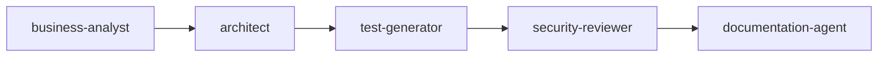
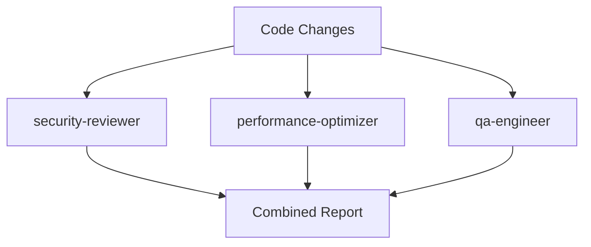
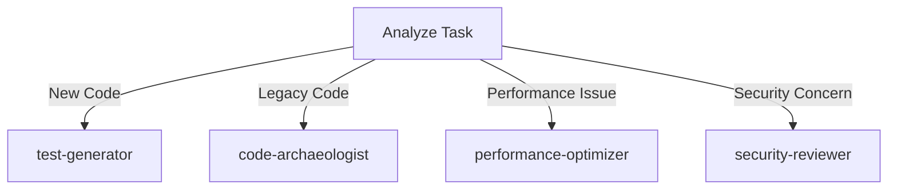
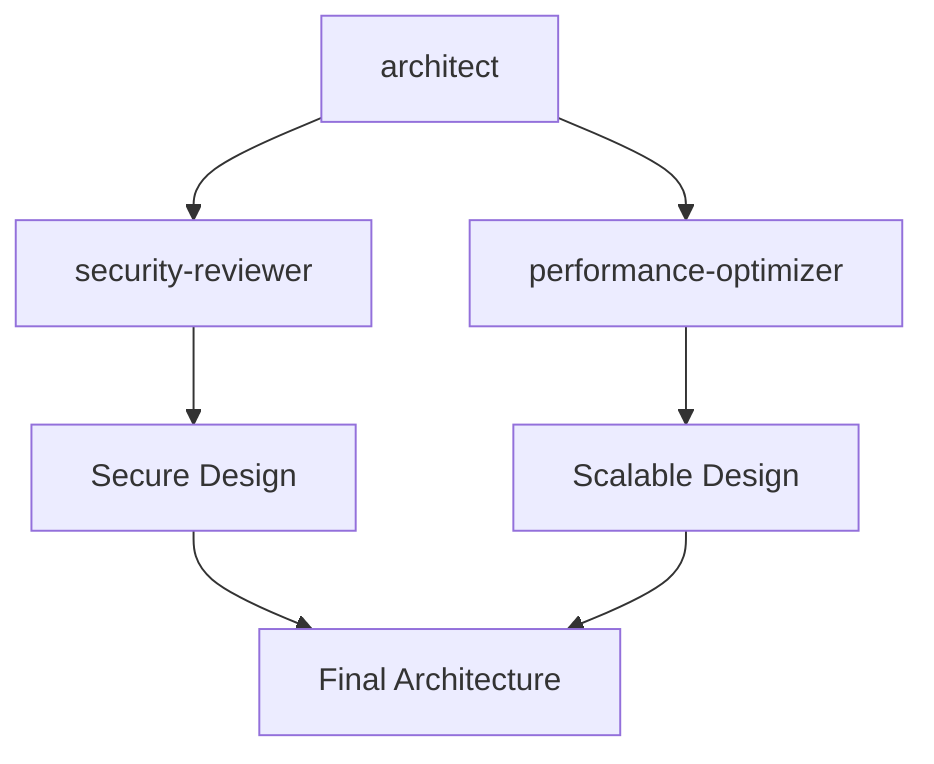

# Agent Ecosystem Documentation

A comprehensive guide to the Claude Code agent ecosystem, including agent types, composition patterns, and best practices.

## Table of Contents

1. [Agent Hierarchy](#agent-hierarchy)
2. [Agent Categories](#agent-categories)
3. [Agent Composition Patterns](#agent-composition-patterns)
4. [When to Use Which Agent](#when-to-use-which-agent)
5. [Creating New Agents](#creating-new-agents)
6. [Agent Versioning](#agent-versioning)
7. [Testing Agents](#testing-agents)
8. [Best Practices](#best-practices)

## Agent Hierarchy

Our agent ecosystem follows a hierarchical structure from general to specific:

```
General Purpose
├── Domain Specialists
│   ├── Architecture & Design
│   ├── Security & Compliance
│   ├── Testing & Quality
│   ├── Documentation
│   └── Project Management
└── Task-Specific Agents
    ├── Code Analysis
    ├── Code Generation
    └── Process Automation
```

## Agent Categories

### 🏗️ Architecture & Design Agents
- **architect** (v1.0.0) - System architecture design and technology selection
- **ui-designer** (v1.0.0) - UI implementation and component architecture
- **ux-optimizer** (v1.0.0) - User experience optimization and accessibility

### 🔒 Security & Compliance Agents
- **security-reviewer** (v1.0.0) - Security vulnerability detection and remediation
- **deployment-agent** (v1.0.0) - Secure deployment and CI/CD configuration

### 🧪 Testing & Quality Agents
- **test-generator** (v1.0.0) - TDD test suite creation
- **qa-engineer** (v1.0.0) - Quality assurance and test planning
- **performance-optimizer** (v1.0.0) - Performance profiling and optimization

### 📚 Documentation Agents
- **documentation-agent** (v1.0.0) - General technical documentation
- **docs-tutorial-agent** (v1.0.0) - Learning-oriented tutorials
- **docs-howto-agent** (v1.0.0) - Task-oriented how-to guides
- **docs-reference-agent** (v1.0.0) - API and technical reference
- **docs-explanation-agent** (v1.0.0) - Conceptual explanations

### 📊 Project Management Agents
- **project-manager** (v1.0.0) - Project planning and coordination
- **product-owner** (v1.0.0) - Product strategy and prioritization
- **scrum-master** (v1.0.0) - Agile process facilitation
- **business-analyst** (v1.0.0) - Requirements analysis and documentation

### 🔍 Code Analysis Agents
- **code-archaeologist** (v1.0.0) - Legacy code reverse engineering

## Agent Composition Patterns

### Sequential Pipeline
Agents work in sequence, each building on the previous output:



**Example Use Case**: New feature development
1. Business analyst gathers requirements
2. Architect designs the solution
3. Test generator creates test suite
4. Security reviewer validates implementation
5. Documentation agent creates user docs

### Parallel Analysis
Multiple agents analyze the same input simultaneously:



**Example Use Case**: Pre-deployment validation
- All three agents analyze code in parallel
- Results are combined into comprehensive report
- Faster than sequential analysis

### Conditional Routing
Agent selection based on context:



**Example Use Case**: Intelligent task routing
- System analyzes the request
- Routes to most appropriate specialist
- Can cascade to other agents if needed

### Hierarchical Delegation
Parent agent delegates to specialized children:



## When to Use Which Agent

### Starting New Projects
1. **business-analyst** - Gather and document requirements
2. **architect** - Design system architecture
3. **test-generator** - Create initial test suite

### Code Review & Quality
1. **security-reviewer** - Security vulnerability scanning
2. **qa-engineer** - Quality assurance testing
3. **performance-optimizer** - Performance analysis

### Documentation Needs
- **Learning new system?** → docs-tutorial-agent
- **Solving specific problem?** → docs-howto-agent
- **Looking up details?** → docs-reference-agent
- **Understanding concepts?** → docs-explanation-agent
- **General documentation?** → documentation-agent

### Legacy Code Work
1. **code-archaeologist** - Understand existing code
2. **test-generator** - Add missing tests
3. **documentation-agent** - Document findings

## Creating New Agents

### Agent Template
```markdown
---
name: agent-name
version: v1.0.0
author: Your Name
last_updated: YYYY-MM-DD
description: Clear, focused description of agent's single responsibility
model: sonnet|opus  # Choose based on complexity
color: color-name
tools: List, Of, Required, Tools
---

## Quick Reference
- Key capability 1
- Key capability 2
- Key capability 3

## Behavioral Contract

### ALWAYS:
- Explicit required behaviors
- Quality standards to maintain
- Output format requirements

### NEVER:
- Prohibited actions
- Boundaries not to cross
- Things to avoid

## [Agent-specific sections]

## Pipeline Integration

### Input Requirements
- What this agent needs to function

### Output Contract
- What this agent produces

### Compatible Agents
- **Upstream**: Agents that feed into this
- **Downstream**: Agents this feeds into

## Edge Cases & Failure Modes

### When [Common Edge Case]
- **Behavior**: What the agent does
- **Output**: What it returns
- **Fallback**: Alternative approach

## Changelog
- **v1.0.0** (YYYY-MM-DD): Initial release
```

### Design Principles
1. **Single Responsibility**: One agent, one purpose
2. **Clear Boundaries**: Explicit MUST/MUST NOT rules
3. **Predictable Behavior**: Consistent across invocations
4. **Composable**: Works well with other agents
5. **Well-Documented**: Self-explanatory usage

## Agent Versioning

### Version Format: `v[MAJOR].[MINOR].[PATCH]`

- **MAJOR**: Breaking changes to behavior or interface
- **MINOR**: New capabilities, backward compatible
- **PATCH**: Bug fixes, documentation updates

### Examples
- `v1.0.0` → Initial stable release
- `v1.1.0` → Added new analysis patterns
- `v1.1.1` → Fixed false positive in detection
- `v2.0.0` → Changed output format (breaking)

## Testing Agents

### Test Categories
1. **Unit Tests**: Individual agent functions
2. **Integration Tests**: Agent interactions
3. **Pipeline Tests**: Complete workflows
4. **Edge Case Tests**: Boundary conditions

### Test Template
```python
def test_agent_basic_functionality():
    """Test agent performs its core function."""
    result = invoke_agent("agent-name", test_input)
    assert result.status == "success"
    assert expected_output in result.output

def test_agent_edge_case():
    """Test agent handles edge cases gracefully."""
    result = invoke_agent("agent-name", edge_case_input)
    assert result.handled_gracefully
    assert result.fallback_used

def test_agent_pipeline():
    """Test agent works in pipeline."""
    result1 = invoke_agent("upstream-agent", input)
    result2 = invoke_agent("agent-name", result1.output)
    assert result2.compatible_with_downstream
```

## Best Practices

### DO ✅
- Keep agents focused on single responsibility
- Document behavioral contracts clearly
- Version agents properly
- Test agent interactions
- Use appropriate model (sonnet for simple, opus for complex)
- Define clear input/output contracts
- Handle edge cases gracefully

### DON'T ❌
- Create "kitchen sink" agents that do everything
- Overlap agent responsibilities
- Skip documentation
- Ignore version compatibility
- Use opus for simple tasks (wastes resources)
- Assume agents know context
- Modify without incrementing version

## Agent Communication Patterns

### Direct Invocation
```bash
@agent-name "Task description"
```

### Pipeline Invocation
```bash
@business-analyst "Gather requirements" | 
@architect "Design solution" |
@test-generator "Create tests"
```

### Parallel Invocation
```bash
@security-reviewer @performance-optimizer @qa-engineer "Review PR #123"
```

## Troubleshooting

### Agent Not Found
- Check agent name spelling
- Verify agent file exists in `agents/` directory
- Ensure proper frontmatter format

### Unexpected Output
- Check agent version
- Verify input format matches requirements
- Review behavioral contract
- Check for edge cases

### Poor Performance
- Consider using lighter model (sonnet vs opus)
- Break complex agents into smaller ones
- Use parallel execution where possible

## Future Enhancements

### Planned Improvements
1. **Auto-routing**: Intelligent agent selection based on context
2. **Learning**: Agents that improve from feedback
3. **Metrics**: Performance and effectiveness tracking
4. **Visualization**: Agent interaction diagrams
5. **Testing Framework**: Automated agent testing suite

### Contributing
See [CONTRIBUTING.md](../CONTRIBUTING.md) for guidelines on:
- Creating new agents
- Improving existing agents
- Proposing agent ecosystem changes
- Testing requirements
- Documentation standards

---

*Last Updated: 2025-08-07*
*Agent Count: 23*
*Latest Version: v1.0.0*