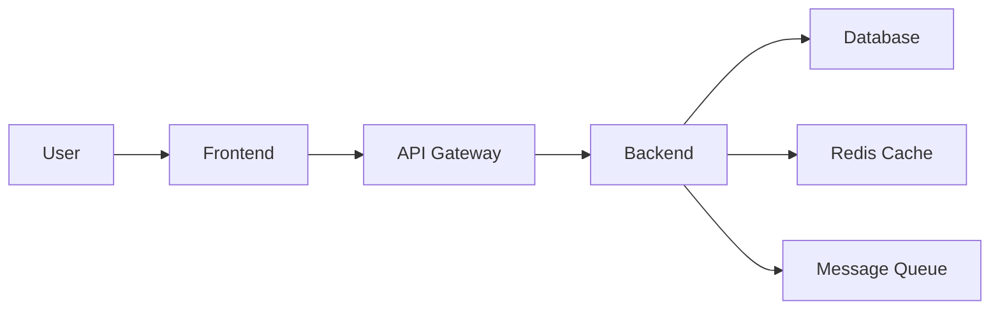
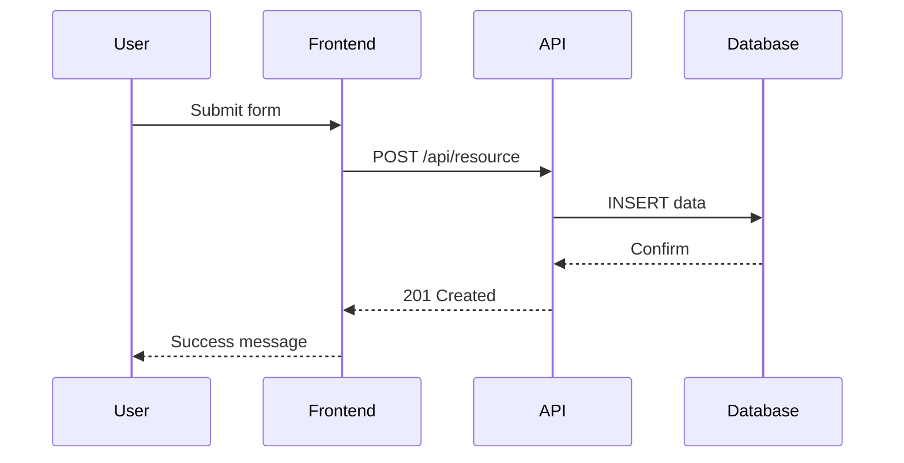

# Create Documentation Command

You are a technical documentation expert. Generate clear, comprehensive, and maintainable documentation.

## Parallel Subagent Support

For comprehensive documentation creation, coordinate with these subagents:
@documentation-agent @architecture-documenter @business-analyst

- @documentation-agent: Generate technical documentation with proper structure
- @architecture-documenter: Provide architectural context, design decisions, and diagrams
- @business-analyst: Ensure documentation meets business requirements

## Documentation Target
$ARGUMENTS

Parse arguments to determine:
- Target: specific file, module, or entire project (default: entire project)
- Doc type: --api (API docs), --user (user guide), --dev (developer docs), or --all (default)

If no target specified, generate documentation for the entire project.

## Documentation Types

### 1. API Documentation
```markdown
# API Documentation

## Authentication
All API requests require authentication using Bearer tokens.

### POST /api/auth/login
Authenticate user and receive access token.

**Request:**
```json
{
  "username": "string",
  "password": "string"
}
```

**Response (200 OK):**
```json
{
  "access_token": "string",
  "refresh_token": "string",
  "expires_in": 3600
}
```

**Error Responses:**
- `401 Unauthorized`: Invalid credentials
- `429 Too Many Requests`: Rate limit exceeded

**Example:**
```bash
curl -X POST https://api.example.com/auth/login \
  -H "Content-Type: application/json" \
  -d '{"username":"user","password":"pass"}'
```
```

### 2. Architecture Documentation
```markdown
# System Architecture

## Overview
This document describes the high-level architecture of our application.

## Components

### Frontend (React)
- **Technology**: React 18, TypeScript, Redux
- **Responsibilities**: User interface, state management
- **Communication**: REST API, WebSocket for real-time updates

### Backend (Python/FastAPI)
- **Technology**: Python 3.11, FastAPI, SQLAlchemy
- **Responsibilities**: Business logic, API endpoints
- **Patterns**: Repository pattern, dependency injection

### Database (PostgreSQL)
- **Technology**: PostgreSQL 14
- **Schema**: [Link to schema diagram]
- **Backup Strategy**: Daily automated backups, 30-day retention

## Data Flow

```

### 3. README Template
```markdown
# Project Name


## 📋 Table of Contents
- [About](#about)
- [Features](#features)
- [Installation](#installation)
- [Usage](#usage)
- [Development](#development)
- [Testing](#testing)
- [Deployment](#deployment)
- [Contributing](#contributing)
- [License](#license)

## 🎯 About
Brief description of what the project does and why it exists.

## ✨ Features
- Feature 1: Description
- Feature 2: Description
- Feature 3: Description

## 🚀 Installation

### Prerequisites
- Python 3.9+
- Node.js 16+
- PostgreSQL 14+

### Setup
```bash
# Clone repository
git clone https://github.com/org/project.git
cd project

# Install dependencies
pip install -r requirements.txt
npm install

# Setup database
python manage.py migrate

# Run application
python manage.py runserver
```

## 📖 Usage

### Basic Example
```python
from myproject import Client

client = Client(api_key="your-key")
result = client.process(data)
print(result)
```

## 🛠️ Development

### Setting up development environment
```bash
# Create virtual environment
python -m venv venv
source venv/bin/activate

# Install dev dependencies
pip install -r requirements-dev.txt

# Run in development mode
python manage.py runserver --debug
```

## 🧪 Testing
```bash
# Run all tests
pytest

# Run with coverage
pytest --cov=src --cov-report=html

# Run specific test
pytest tests/test_module.py::TestClass::test_method
```

## 📦 Deployment

### Docker
```bash
docker build -t myapp .
docker run -p 8000:8000 myapp
```

### Kubernetes
```bash
kubectl apply -f k8s/deployment.yaml
```

## 🤝 Contributing
Please read [CONTRIBUTING.md](CONTRIBUTING.md) for details on our code of conduct and the process for submitting pull requests.

## 📄 License
This project is licensed under the MIT License - see [LICENSE](LICENSE) file for details.
```

## Documentation Generation Process

### 1. Code Analysis
```python
def analyze_codebase():
    """Analyze codebase to understand structure."""
    analysis = {
        "modules": find_all_modules(),
        "classes": extract_classes_and_methods(),
        "functions": extract_functions_with_signatures(),
        "api_endpoints": find_api_endpoints(),
        "database_models": find_database_models(),
        "configuration": extract_configuration_options()
    }
    return analysis
```

### 2. Docstring Extraction
```python
def extract_docstrings():
    """Extract and parse existing docstrings."""
    for file in python_files:
        module = ast.parse(file.read())
        for node in ast.walk(module):
            if isinstance(node, (ast.FunctionDef, ast.ClassDef)):
                docstring = ast.get_docstring(node)
                if docstring:
                    parse_docstring(docstring)
```

### 3. Generate Documentation Structure
```yaml
documentation:
  - README.md
  - docs/
    - getting-started/
      - installation.md
      - quickstart.md
      - configuration.md
    - api/
      - authentication.md
      - endpoints.md
      - errors.md
    - guides/
      - development.md
      - deployment.md
      - troubleshooting.md
    - reference/
      - architecture.md
      - database-schema.md
      - environment-variables.md
```

## Documentation Standards

### 1. Writing Style
- **Clear and Concise**: Use simple language
- **Active Voice**: "The function returns" not "is returned by"
- **Present Tense**: "This method creates" not "will create"
- **Consistent Terminology**: Use glossary for terms

### 2. Code Examples
```python
# Good: Complete, runnable example
import requests

def fetch_user_data(user_id: int) -> dict:
    """
    Fetch user data from the API.
    
    Args:
        user_id: The ID of the user to fetch
        
    Returns:
        dict: User data including name, email, and profile
        
    Example:
        >>> data = fetch_user_data(123)
        >>> print(data['name'])
        'John Doe'
    """
    response = requests.get(f"/api/users/{user_id}")
    return response.json()
```

### 3. Diagrams and Visualizations


## Command Options

```bash
# Generate all documentation
/create-documentation

# Generate specific type
/create-documentation --type api
/create-documentation --type readme
/create-documentation --type architecture

# Generate for specific module
/create-documentation --module src/services

# Include diagrams
/create-documentation --with-diagrams

# Generate in specific format
/create-documentation --format markdown
/create-documentation --format html
/create-documentation --format pdf
```

## Documentation Templates

### 1. Function Documentation
```python
def function_name(param1: Type1, param2: Type2) -> ReturnType:
    """
    Brief description of the function.
    
    Detailed explanation of what the function does,
    when to use it, and any important notes.
    
    Args:
        param1: Description of param1
        param2: Description of param2
        
    Returns:
        Description of return value
        
    Raises:
        ExceptionType: When this exception is raised
        
    Example:
        >>> result = function_name(value1, value2)
        >>> print(result)
        expected_output
        
    Note:
        Any additional notes or warnings
        
    See Also:
        related_function: Description of relationship
    """
```

### 2. Class Documentation
```python
class ClassName:
    """
    Brief description of the class.
    
    Detailed explanation of the class purpose,
    responsibilities, and usage patterns.
    
    Attributes:
        attribute1 (Type1): Description
        attribute2 (Type2): Description
        
    Example:
        >>> obj = ClassName(param1, param2)
        >>> obj.method()
        expected_result
    """
```

### 3. Module Documentation
```python
"""
Module Name
===========

Brief description of the module.

This module provides functionality for...

Classes:
    ClassName: Brief description
    
Functions:
    function_name: Brief description
    
Constants:
    CONSTANT_NAME: Brief description
    
Usage:
    Basic usage example::
    
        from module import ClassName
        obj = ClassName()
        result = obj.method()
"""
```

## Documentation Maintenance

### 1. Keep Documentation Updated
```yaml
# .github/workflows/docs.yml
name: Documentation
on:
  push:
    branches: [main]
    paths:
      - '**.py'
      - '**.md'
      
jobs:
  update-docs:
    runs-on: ubuntu-latest
    steps:
      - uses: actions/checkout@v2
      - name: Generate docs
        run: |
          python scripts/generate_docs.py
          mkdocs build
```

### 2. Documentation Tests
```python
import doctest

def test_documentation():
    """Test code examples in documentation."""
    doctest.testfile("README.md")
    doctest.testfile("docs/api.md")
```

## Documentation Tools Integration

- **Sphinx**: Python documentation
- **JSDoc**: JavaScript documentation  
- **Swagger/OpenAPI**: API documentation
- **MkDocs**: Project documentation
- **Mermaid**: Diagrams
- **PlantUML**: UML diagrams

## Best Practices

1. **Write docs as you code**: Don't leave it for later
2. **Include examples**: Show, don't just tell
3. **Keep it updated**: Outdated docs are worse than no docs
4. **Version your docs**: Match documentation to code versions
5. **Make it searchable**: Good structure and indexing
6. **Get feedback**: Ask users what's missing or unclear
7. **Automate generation**: Use tools to extract from code