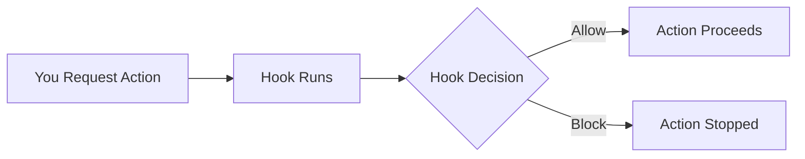

# Tutorial 2: Your First Hook - Automate Quality Checks 🪝

Welcome back! Now that you've created your first agent, let's learn about **hooks** - automated helpers that run at specific moments to keep your code quality high. In the next 20 minutes, you'll build a hook that prevents you from accidentally leaving TODOs in your code!

## What You'll Build

You're going to create a **TODO Checker Hook** that:
- Automatically runs before you edit files
- Checks for unfinished TODOs
- Prevents edits if TODOs are found
- Helps maintain clean, production-ready code

## Prerequisites

- ✅ Completed [Tutorial 1: Your First Agent](01-first-agent.md) (or know agent basics)
- ✅ Claude Code installed
- ✅ A text editor

Ready? Let's automate! 🚀

---

## Step 1: Understanding Hooks (2 minutes)

Before we build, let's understand what hooks are:

### What Are Hooks? 
**Hooks are automated scripts** that run at specific moments in your Claude Code workflow:



### The Four Hook Types

| Hook Type | When It Runs | Common Uses |
|-----------|--------------|-------------|
| **pre-edit** | Before editing files | Check code quality, validate changes |
| **post-edit** | After editing files | Format code, update docs |
| **pre-run** | Before running commands | Security checks, validate environment |
| **post-run** | After running commands | Cleanup, notifications |

Today we'll build a **pre-edit** hook!

---

## Step 2: Create Your Hook File (5 minutes)

Let's create a hook that checks for TODOs before allowing edits:

```bash
# Create hooks directory if it doesn't exist
mkdir -p ~/.claude/hooks

# Create your first hook
cat > ~/.claude/hooks/todo-checker.json << 'EOF'
{
  "name": "todo-checker",
  "description": "Prevents editing files that contain unfinished TODOs",
  "version": "1.0.0",
  "author": "Your Name",
  "events": ["pre-edit"],
  "enabled": true,
  "config": {
    "todoPatterns": ["TODO:", "FIXME:", "HACK:", "XXX:"],
    "allowedExtensions": [".md", ".txt", ".py", ".js", ".ts"],
    "maxTodosAllowed": 0,
    "customMessage": "⚠️  Found unfinished TODOs! Please complete them before editing."
  },
  "script": "#!/bin/bash\n\n# Parse the context from Claude Code\nCONTEXT_JSON=\"$1\"\nFILE_PATH=$(echo \"$CONTEXT_JSON\" | jq -r '.file')\n\n# Check if file exists and should be checked\nif [ ! -f \"$FILE_PATH\" ]; then\n  echo '{\"allow\": true}'\n  exit 0\nfi\n\n# Get file extension\nEXT=\".${FILE_PATH##*.}\"\n\n# Check if we should scan this file type\nSHOULD_CHECK=false\nfor allowed in .md .txt .py .js .ts; do\n  if [ \"$EXT\" = \"$allowed\" ]; then\n    SHOULD_CHECK=true\n    break\n  fi\ndone\n\nif [ \"$SHOULD_CHECK\" = false ]; then\n  echo '{\"allow\": true}'\n  exit 0\nfi\n\n# Check for TODOs\nif grep -E \"TODO:|FIXME:|HACK:|XXX:\" \"$FILE_PATH\" > /dev/null 2>&1; then\n  # Found TODOs - block the edit\n  TODO_COUNT=$(grep -c -E \"TODO:|FIXME:|HACK:|XXX:\" \"$FILE_PATH\")\n  echo \"{\"\n  echo '  \"allow\": false,'\n  echo \"  \\\"message\\\": \\\"⚠️  Found $TODO_COUNT unfinished TODO(s) in $FILE_PATH! Please complete them first.\\\",\"\n  echo '  \"details\": {'\n  echo \"    \\\"todos_found\\\": $TODO_COUNT,\"\n  echo \"    \\\"file\\\": \\\"$FILE_PATH\\\"\"\n  echo '  }'\n  echo \"}\"\nelse\n  # No TODOs - allow the edit\n  echo '{\"allow\": true, \"message\": \"✅ No TODOs found - proceeding with edit\"}'\nfi"
}
EOF

echo "✅ Hook created successfully!"
```

**🎉 Great job!** You've created your first hook. Let's understand what you built!

---

## Step 3: Understand Your Hook Structure (3 minutes)

Your hook has several important parts:

### Hook Metadata
```json
{
  "name": "todo-checker",           // Hook identifier
  "description": "Prevents...",     // What it does
  "events": ["pre-edit"],          // When it runs
  "enabled": true                   // Is it active?
}
```

### Hook Configuration
```json
"config": {
  "todoPatterns": ["TODO:", "FIXME:"],  // What to look for
  "allowedExtensions": [".py", ".js"],  // Which files to check
  "maxTodosAllowed": 0                  // Threshold (0 = no TODOs)
}
```

### Hook Script
The `script` field contains a bash script that:
1. Receives context from Claude Code
2. Checks the file for TODOs
3. Returns `allow: true` or `allow: false`

Think of hooks as **quality gatekeepers** for your code!

---

## Step 4: Test Your Hook (5 minutes)

Now let's see your hook in action!

### Create a Test File with TODOs

```bash
# Create a test file with a TODO
cat > ~/test-todos.py << 'EOF'
def calculate_tax(amount):
    # TODO: Implement proper tax calculation
    return amount * 0.1

def process_payment(order):
    # FIXME: Add payment validation
    total = order.amount + calculate_tax(order.amount)
    return total
EOF

echo "✅ Test file created with TODOs"
```

### Try to Edit the File (Hook Will Block!)

```bash
# Try to edit with Claude Code
claude "Fix the calculate_tax function in ~/test-todos.py"
```

**Expected Result:**
```
⚠️  Found 2 unfinished TODO(s) in ~/test-todos.py! Please complete them first.
```

**🎉 Your hook is working!** It prevented the edit because TODOs were found!

### Fix the TODOs and Try Again

```bash
# Remove the TODOs
cat > ~/test-todos.py << 'EOF'
def calculate_tax(amount):
    # Properly calculate tax based on region
    tax_rate = 0.08  # 8% tax rate
    return amount * tax_rate

def process_payment(order):
    # Validate payment before processing
    if not order.is_valid():
        raise ValueError("Invalid order")
    total = order.amount + calculate_tax(order.amount)
    return total
EOF

echo "✅ TODOs removed from file"
```

### Edit Successfully (Hook Will Allow!)

```bash
# Now try editing again
claude "Add a docstring to calculate_tax in ~/test-todos.py"
```

**Expected Result:**
```
✅ No TODOs found - proceeding with edit
[Claude edits the file successfully]
```

**🎊 Perfect!** Your hook allowed the edit after TODOs were removed!

---

## Step 5: Debug Your Hook (3 minutes)

Sometimes hooks don't trigger as expected. Here's how to debug:

### Check If Hook Is Enabled

```bash
# List all hooks and their status
ls -la ~/.claude/hooks/
cat ~/.claude/hooks/todo-checker.json | jq '.enabled'
```

### Test Hook Manually

```bash
# Create a test context
echo '{"file": "~/test-todos.py", "action": "edit"}' > /tmp/test-context.json

# Run your hook script manually
bash -c "$(cat ~/.claude/hooks/todo-checker.json | jq -r '.script')" -- "$(cat /tmp/test-context.json)"
```

### Enable Debug Output

Add debug logging to your hook:

```bash
# Edit your hook to add debug output
cat > ~/.claude/hooks/todo-checker-debug.json << 'EOF'
{
  "name": "todo-checker-debug",
  "events": ["pre-edit"],
  "enabled": true,
  "script": "#!/bin/bash\necho \"DEBUG: Hook triggered for file: $1\" >&2\n# ... rest of script"
}
EOF
```

### Common Issues and Fixes

| Problem | Solution |
|---------|----------|
| Hook not triggering | Check `"enabled": true` and correct event type |
| Script errors | Test script manually with bash |
| Wrong file paths | Use absolute paths, not relative |
| Permission denied | `chmod +x` on script file if saved separately |

---

## Step 6: Customize Your Hook (5 minutes)

Let's make your hook even better!

### Add More TODO Patterns

Edit `~/.claude/hooks/todo-checker.json` and update:

```json
"todoPatterns": [
  "TODO:",
  "FIXME:", 
  "HACK:",
  "XXX:",
  "BUG:",
  "OPTIMIZE:",
  "REFACTOR:"
]
```

### Create Warning Levels

Instead of blocking, you could warn:

```json
"config": {
  "mode": "warn",  // "block" or "warn"
  "severity": {
    "TODO": "low",
    "FIXME": "medium",
    "BUG": "high"
  }
}
```

### Add File-Specific Rules

```json
"rules": {
  "*.test.js": {
    "skip": true  // Don't check test files
  },
  "*.prod.js": {
    "maxTodosAllowed": 0  // Strict for production
  }
}
```

### Create a Summary Report

Modify the script to show TODO locations:

```bash
# In the script section, add:
TODOS=$(grep -n -E "TODO:|FIXME:" "$FILE_PATH")
echo "Found TODOs at:"
echo "$TODOS"
```

---

## What You Learned 🎓

Fantastic work! Here's what you mastered in this tutorial:

### ✅ Hook Concepts
1. **Hooks are event-driven** - They run at specific moments
2. **Four hook types** - pre-edit, post-edit, pre-run, post-run
3. **Hooks return decisions** - allow: true/false
4. **Configuration is flexible** - Customize behavior via config

### ✅ Practical Skills
- Creating hook files with JSON structure
- Writing hook scripts in bash
- Testing hooks with real scenarios
- Debugging when hooks don't work
- Customizing hook behavior

### ✅ Hook Lifecycle
```
1. You request an action (edit file)
2. Claude Code triggers relevant hooks
3. Hook receives context (filename, action)
4. Hook script runs checks
5. Hook returns allow/block decision
6. Action proceeds or stops based on decision
```

---

## Challenge Yourself! 🏆

### 🌟 Easy: Add More Patterns
Add support for language-specific TODOs like `# NOTE:` for Python

### 🌟🌟 Medium: Create a Formatter Hook
Build a `post-edit` hook that auto-formats code after edits

### 🌟🌟🌟 Hard: Build a Security Scanner
Create a `pre-run` hook that checks for hardcoded secrets

---

## Real-World Hook Ideas 💡

Now that you understand hooks, here are practical uses:

### Quality Gates
- Check test coverage before commits
- Validate JSON/YAML syntax
- Enforce coding standards
- Require documentation updates

### Security
- Scan for API keys and passwords
- Check dependency vulnerabilities  
- Validate file permissions
- Audit sensitive operations

### Automation
- Auto-generate documentation
- Update version numbers
- Sync configuration files
- Send notifications to team

---

## Troubleshooting Guide 🔧

### Hook Not Triggering?

1. **Check if enabled:**
   ```bash
   cat ~/.claude/hooks/todo-checker.json | jq '.enabled'
   ```

2. **Verify event type:**
   ```bash
   cat ~/.claude/hooks/todo-checker.json | jq '.events'
   ```

3. **Test manually:**
   ```bash
   claude --debug "edit file.py"  # Shows hook execution
   ```

### Script Errors?

1. **Check syntax:**
   ```bash
   bash -n your-script.sh
   ```

2. **Add logging:**
   ```bash
   echo "DEBUG: Variable = $VAR" >&2
   ```

3. **Check permissions:**
   ```bash
   ls -la ~/.claude/hooks/
   ```

---

## What's Next? 🚀

You've learned how to automate quality checks with hooks! Ready for more?

### Continue Learning:
→ **[Tutorial 3: Your First Workflow](03-first-workflow.md)** - Combine agents and hooks! (30 min)

### Jump to Practical Tasks:
- [How to Debug Hooks](../how-to/debug-hook.md)
- [How to Chain Multiple Hooks](../how-to/chain-hooks.md)
- [How to Share Hooks with Team](../how-to/share-hooks.md)

### Understand the Concepts:
- [Hook Lifecycle Deep Dive](../explanation/hook-lifecycle.md)
- [Hook Security Model](../explanation/hook-security.md)

---

## Summary Card 📋

```yaml
Tutorial: Your First Hook
Time Taken: 20 minutes
You Created: todo-checker hook
Hook Type: pre-edit (quality gate)
You Learned: Hook structure, lifecycle, debugging
Success: Prevented edits with TODOs ✅
Next Step: Tutorial 3 - Your First Workflow
```

---

## Celebration Time! 🎊

**AMAZING WORK!** You've just leveled up your Claude Code skills!

You can now:
- ✅ Create quality gates for your code
- ✅ Automate repetitive checks
- ✅ Customize your development workflow
- ✅ Debug and fix hook issues

Share your achievement:
- Show your team the TODO checker
- Create hooks for your specific needs
- Share in [Discord](https://discord.gg/claudecode)

Remember: **Automation is a superpower** - you're building it!

---

<div align="center">

**Ready for workflows?** → [Continue to Tutorial 3: Your First Workflow](03-first-workflow.md)

[Back to Tutorials](README.md) | [Back to Documentation](../README.md)

</div>