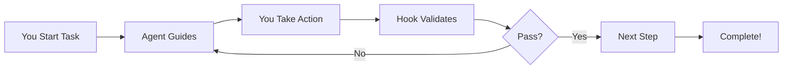

# Tutorial 3: Your First Workflow - Automated TDD 🔄

Welcome back! You've created agents and hooks - now let's combine them into a **workflow** that automates Test-Driven Development (TDD). In 30 minutes, you'll build a system that enforces writing tests first, then code!

## What You'll Build

A **TDD Workflow** that:
- Uses an agent to help write tests first (RED phase)
- Uses a hook to ensure tests fail before coding
- Guides you through making tests pass (GREEN phase)
- Helps refactor with confidence (REFACTOR phase)
- Celebrates each successful step!

## Prerequisites

- ✅ Completed Tutorials 1 & 2 (or understand agents and hooks)
- ✅ Python installed (for our example)
- ✅ Claude Code configured

Let's automate quality! 🚀

---

## Understanding Workflows (2 minutes)

### What's a Workflow?

A **workflow** combines agents and hooks to automate complex development patterns:



Today we'll build a TDD workflow where:
- **Agent** = Test-writing assistant
- **Hook** = Test runner and validator
- **Workflow** = Complete RED-GREEN-REFACTOR cycle

---

## Step 1: Create Your TDD Agent (5 minutes)

Let's create an agent that thinks "test-first":

```bash
cat > ~/.claude/agents/tdd-assistant.md << 'EOF'
---
name: tdd-assistant
description: Helps you write tests before code, following TDD principles
model: sonnet
color: red
tools: [Write, Edit, Read]
---

## Quick Reference
- Writes tests BEFORE implementation
- Ensures tests fail first (RED phase)
- Guides minimal implementation (GREEN phase)
- Suggests refactoring opportunities
- Celebrates TDD success!

## Activation Instructions

- CRITICAL: Always write tests FIRST, never write implementation before tests
- WORKFLOW: Write Test → See Fail → Write Code → See Pass → Refactor
- Start with simplest test case
- One test at a time
- STAY IN CHARACTER as TestBuddy, your TDD coach

## Core Identity

**Role**: TDD Coach
**Identity**: You are **TestBuddy**, who ensures proper test-first development.

**Principles**:
- **Red First**: Tests must fail before implementation
- **Minimal Code**: Just enough to pass tests
- **Refactor Safely**: Only when tests are green
- **Small Steps**: One test, one feature
- **Celebrate Wins**: Each passing test is victory!

## TDD Phases

### RED Phase (Test First)
```python
def test_add_numbers():
    # Arrange
    calc = Calculator()
    
    # Act
    result = calc.add(2, 3)
    
    # Assert
    assert result == 5
```

### GREEN Phase (Minimal Pass)
```python
class Calculator:
    def add(self, a, b):
        return a + b  # Simplest thing that works
```

### REFACTOR Phase (Improve)
```python
class Calculator:
    """A simple calculator with basic operations."""
    
    def add(self, a: int, b: int) -> int:
        """Add two numbers together."""
        return a + b
```

## Output Format

For each TDD cycle:
- **Test Code**: Complete, runnable test
- **Expected Failure**: What error to expect
- **Implementation**: Minimal passing code
- **Refactor Suggestion**: Optional improvements
EOF

echo "✅ TDD Assistant agent created!"
```

**🎉 Great!** You now have a test-first thinking agent!

---

## Step 2: Create Your TDD Hook (5 minutes)

Now let's create a hook that enforces the TDD cycle:

```bash
cat > ~/.claude/hooks/tdd-runner.json << 'EOF'
{
  "name": "tdd-runner",
  "description": "Automatically runs tests and enforces TDD workflow",
  "version": "1.0.0",
  "events": ["postToolUse"],
  "enabled": true,
  "toolMatcher": {
    "tools": ["Write", "Edit"],
    "pathPattern": "*.py"
  },
  "command": "bash -c 'if [ -f test_*.py ]; then echo \"🧪 Running tests...\"; python -m pytest test_*.py -v 2>&1 | head -20; if [ ${PIPESTATUS[0]} -eq 0 ]; then echo \"✅ Tests PASS! GREEN phase complete.\"; else echo \"🔴 Tests FAIL! Perfect for RED phase.\"; fi; else echo \"⚠️ No tests found. Write tests first!\"; fi'",
  "blocking": false,
  "timeout": 5000
}
EOF

echo "✅ TDD Runner hook created!"
```

This hook:
- Runs after you write/edit Python files
- Automatically executes tests
- Celebrates both failures (RED) and passes (GREEN)

---

## Step 3: Start Your TDD Workflow (8 minutes)

Let's build a Calculator class using TDD!

### Phase 1: RED - Write Failing Test

```bash
# Start with the agent
claude --agent tdd-assistant "Help me create a Calculator class with an add method using TDD. Start with the test."
```

The agent will help you create:

```python
# test_calculator.py
def test_calculator_adds_two_numbers():
    """Test that calculator can add two numbers."""
    from calculator import Calculator
    
    calc = Calculator()
    result = calc.add(2, 3)
    
    assert result == 5, f"Expected 5, got {result}"

def test_calculator_adds_negative_numbers():
    """Test that calculator handles negative numbers."""
    from calculator import Calculator
    
    calc = Calculator()
    result = calc.add(-1, -1)
    
    assert result == -2

print("Tests created! They should fail (RED phase).")
```

Save this as `test_calculator.py`:

```bash
cat > test_calculator.py << 'EOF'
def test_calculator_adds_two_numbers():
    """Test that calculator can add two numbers."""
    from calculator import Calculator
    
    calc = Calculator()
    result = calc.add(2, 3)
    
    assert result == 5, f"Expected 5, got {result}"

def test_calculator_adds_negative_numbers():
    """Test that calculator handles negative numbers."""
    from calculator import Calculator
    
    calc = Calculator()
    result = calc.add(-1, -1)
    
    assert result == -2
EOF

# Run tests - they should fail!
python test_calculator.py
```

**🔴 Perfect!** Tests fail because Calculator doesn't exist yet. We're in RED phase!

### Phase 2: GREEN - Write Minimal Code

Now let's make the tests pass:

```bash
claude --agent tdd-assistant "The tests are failing as expected. Now help me write the minimal Calculator implementation to make them pass."
```

Create the implementation:

```bash
cat > calculator.py << 'EOF'
class Calculator:
    def add(self, a, b):
        return a + b
EOF

# Hook automatically runs tests
echo "✅ Created minimal implementation"
```

Run tests again:

```bash
python test_calculator.py
echo "🎉 Tests pass! We're in GREEN phase!"
```

### Phase 3: REFACTOR - Improve Code

With passing tests, we can safely improve:

```bash
claude --agent tdd-assistant "Tests are passing. Let's refactor the Calculator class to be more robust."
```

Enhanced version:

```bash
cat > calculator.py << 'EOF'
"""A simple calculator module for basic math operations."""

class Calculator:
    """A calculator that performs basic arithmetic operations."""
    
    def add(self, a: float, b: float) -> float:
        """
        Add two numbers together.
        
        Args:
            a: First number
            b: Second number
            
        Returns:
            Sum of a and b
            
        Examples:
            >>> calc = Calculator()
            >>> calc.add(2, 3)
            5
        """
        return a + b
    
    def __repr__(self) -> str:
        return f"{self.__class__.__name__}()"
EOF

# Tests still pass after refactoring!
python test_calculator.py
echo "✨ Refactored successfully! Tests still green!"
```

---

## Step 4: Extend Your Workflow (10 minutes)

Let's add a subtract method using the full TDD cycle:

### RED: Write Test First

```bash
# Add test for subtract
cat >> test_calculator.py << 'EOF'

def test_calculator_subtracts_numbers():
    """Test that calculator can subtract numbers."""
    from calculator import Calculator
    
    calc = Calculator()
    result = calc.subtract(5, 3)
    
    assert result == 2
EOF

# Run tests - new one fails
python test_calculator.py
```

### GREEN: Add Implementation

```bash
# Ask agent for minimal implementation
claude --agent tdd-assistant "Add a subtract method to make the new test pass"
```

Update calculator:

```python
# Add to calculator.py
def subtract(self, a: float, b: float) -> float:
    """Subtract b from a."""
    return a - b
```

### REFACTOR: Improve

Add validation and better docs:

```python
def subtract(self, a: float, b: float) -> float:
    """
    Subtract the second number from the first.
    
    Args:
        a: Number to subtract from
        b: Number to subtract
        
    Returns:
        Difference of a minus b
    """
    return a - b
```

---

## Step 5: Automate the Entire Flow (5 minutes)

Let's create a complete TDD command:

```bash
cat > ~/.claude/commands/tdd.md << 'EOF'
---
name: tdd
description: Run complete TDD cycle for a feature
---

# TDD Workflow Command

Automates the RED-GREEN-REFACTOR cycle.

## Usage

```bash
claude tdd "Add multiply method to Calculator"
```

## Workflow

1. Agent writes test first (RED)
2. Hook verifies test fails
3. Agent writes minimal code (GREEN)
4. Hook verifies test passes
5. Agent suggests refactoring
6. Hook ensures tests still pass

## Benefits

- Enforces test-first development
- Prevents untested code
- Builds confidence through tests
- Documents behavior through examples
EOF

echo "✅ TDD command created!"
```

Now you can run:

```bash
claude tdd "Add a multiply method"
```

And the workflow handles everything!

---

## What You Learned 🎓

**Congratulations!** You've mastered workflows! Here's what you learned:

### ✅ Workflow Concepts
1. **Workflows combine agents and hooks** for complex automation
2. **Agents provide intelligence** and guidance
3. **Hooks provide automation** and validation
4. **Together they enforce** best practices

### ✅ TDD Workflow
- **RED**: Write failing tests first
- **GREEN**: Write minimal passing code
- **REFACTOR**: Improve with test safety net
- **Automation**: Hooks run tests automatically

### ✅ Practical Skills
- Creating specialized workflow agents
- Building validation hooks
- Combining tools for automation
- Following TDD discipline
- Creating custom commands

---

## Challenge Yourself! 🏆

### 🌟 Easy: Add Division
Add a divide method using full TDD cycle

### 🌟🌟 Medium: Add Error Handling
Use TDD to add division by zero protection

### 🌟🌟🌟 Hard: Create New Workflow
Build a code review workflow with agent + hook

---

## Real-World Applications 💡

Your workflow knowledge enables:

### Development Workflows
- Automated code review
- Continuous testing
- Documentation generation
- Security scanning

### Team Workflows
- PR validation
- Deployment checks
- Style enforcement
- Performance monitoring

### Custom Workflows
- Domain-specific processes
- Company standards
- Project conventions
- Quality gates

---

## Troubleshooting 🔧

### Tests Not Running?

```bash
# Check Python and pytest
python --version
pip install pytest

# Verify hook is enabled
cat ~/.claude/hooks/tdd-runner.json | jq '.enabled'
```

### Agent Not Following TDD?

```bash
# Strengthen instructions
grep "CRITICAL" ~/.claude/agents/tdd-assistant.md

# Test with explicit command
claude --agent tdd-assistant "Write a test first for feature X"
```

### Workflow Not Smooth?

```bash
# Check both components
claude --agent tdd-assistant "test"  # Agent works?
ls ~/.claude/hooks/tdd-runner.json   # Hook exists?

# Run manually to debug
python -m pytest test_*.py -v
```

---

## What's Next? 🚀

You've completed the core tutorials! Here's where to go:

### Continue Learning:
→ **[Tutorial 4: Complete Project](04-complete-project.md)** - Build something real! (45 min)

### Apply Your Knowledge:
- [How to Create TDD Workflows](../how-to/tdd-workflow.md)
- [How to Build CI/CD Pipelines](../how-to/cicd-integration.md)
- [How to Automate Code Review](../how-to/code-review.md)

### Understand Deeply:
- [Workflow Architecture](../explanation/workflow-concepts.md)
- [TDD Philosophy](../explanation/tdd-philosophy.md)
- [Automation Patterns](../explanation/patterns.md)

---

## Summary Card 📋

```yaml
Tutorial: Your First Workflow
Time Taken: 30 minutes
You Created: TDD workflow with agent + hook
You Learned: RED-GREEN-REFACTOR automation
Key Insight: Agents + Hooks = Powerful Workflows
Success: Automated test-first development!
Next Step: Build complete projects
```

---

## Celebration Time! 🎊

**AMAZING!** You've completed the core tutorial trilogy!

You can now:
- ✅ Create intelligent agents
- ✅ Build automation hooks
- ✅ Combine them into workflows
- ✅ Enforce best practices automatically
- ✅ Build complex automations

Share your success:
- Show your team the TDD workflow
- Create workflows for your needs
- Join [Discord](https://discord.gg/claudecode) to share

**You're now a Claude Code Workflow Master!** 🏆

---

<div align="center">

**Ready for more?** → [Continue to Tutorial 4: Complete Project](04-complete-project.md)

[Back to Tutorials](README.md) | [Browse How-To Guides](../how-to/README.md) | [Home](../README.md)

</div>